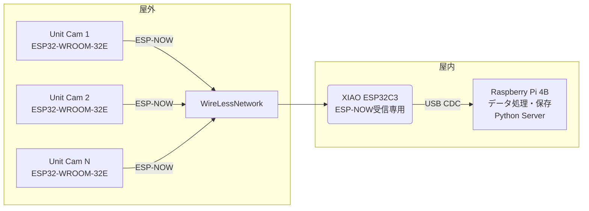

# esp-camera-rs

Rust wrapper library to interface with the ESP32 and ESP32 S3 cameras. The way to define configuration for camera was reworked, get methods added and set methods rewrote to use macro.

## 概要

このライブラリは、ESP32およびESP32-S3マイクロコントローラーとカメラモジュールを簡単に連携させるためのRustラッパーです。カメラの設定方法を改良し、より使いやすいインターフェースを提供しています。

## 特徴

- ESP32およびESP32-S3カメラモジュールへの簡単なアクセス
- 柔軟なカメラ設定インターフェース
- 最適化されたパフォーマンス
- Rustの型安全性と信頼性

## サンプルプロジェクト

本リポジトリには、以下のサンプルプロジェクトが含まれています：

### 1. カメラ画像送信機 (ESP32カメラモジュール)

[examples/image_sender](examples/image_sender/README.md)

M5Stack Unit Cam Wi-Fi Camera (OV2640)などのESP32カメラモジュールを使用して画像を撮影し、ESP-NOWプロトコル経由で送信するプロジェクトです。

主な機能：
- 定期的な画像撮影
- ESP-NOWプロトコルによるデータ転送
- 省電力ディープスリープ制御
- カスタマイズ可能な撮影間隔設定

### 2. USBシリアルレシーバー (ESP32-C3)

[examples/usb_cdc_receiver](examples/usb_cdc_receiver/README.md)

ESP32-C3マイクロコントローラーを使用して、ESP-NOWプロトコルで送信された画像データを受信し、USB CDCを通じてホストPCに転送するプロジェクトです。

主な機能：
- ESP-NOWプロトコルによるデータ受信
- USB CDCによるデータ転送
- 複数カメラからのデータ管理
- 設定ファイルでのカメラ登録

### 3. Pythonサーバー

[examples/python_server](examples/python_server)

USBシリアルレシーバーから送信された画像データを受信し、PCにJPEGファイルとして保存するPythonサーバーです。

主な機能：
- 非同期シリアル通信
- 画像データのデコードと保存
- 複数のカメラからの同時データ受信対応
- 統計情報の記録

## システム構成図 (Mermaid)

## 使用方法

このライブラリを使用するには、examplesディレクトリ内の各プロジェクトを参照してください。それぞれのプロジェクトディレクトリには詳細なREADMEが含まれています。

**注意**: このディレクトリでは直接 `cargo build` を実行しないでください。代わりに、examplesディレクトリ内の各プロジェクトディレクトリで実行してください。

## 開発環境のセットアップ

詳細については、各サンプルプロジェクトのREADMEを参照してください。一般的に以下が必要です：

- Rust (1.70以上推奨)
- ESP-IDF (v5.1以上)
- ESP32/ESP32-S3/ESP32-C3開発ボード
- カメラモジュール（使用するプロジェクトによる）
- cargo-espflash ツール
