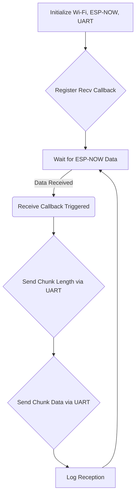

# ESP-NOWによるカメラ画像送信とDeep Sleepの実装計画

## 概要

`examples/camera-example`のコードを改修し、HTTPサーバーとして機能する代わりに、ESP-NOWプロトコルを使用して特定のMACアドレスにカメラ画像を送信する機能を実装する。
さらに、画像を送信した後、10分間のDeep Sleepに入り、Deep Sleepから復帰した際に再度画像を送信するという間欠動作を実装する。

## 詳細 (送信側: camera-example)

1.  **ESP-NOWの初期化**: `esp_now_init()`関数を使用してESP-NOWを初期化する。
2.  **送信コールバック関数の登録**: `esp_now_register_send_cb()`関数を使用して、データ送信後のコールバック関数を登録する。この関数内で、送信成功/失敗のステータスを確認する。
3.  **ピア情報の追加**: `esp_now_add_peer()`関数を使用して、受信側のMACアドレスをピアとして追加する。
4.  **Wi-Fiの初期化**: ESP-NOWはWi-Fiペリフェラルを使用するため、Wi-Fiを初期化 (`EspWifi::new`, `wifi.start()`) する。アクセスポイントへの接続は行わない。
5.  **カメラの初期化**: 既存のコードを再利用して、カメラを初期化する。
6.  **画像取得とESP-NOWでの送信**:
    *   カメラから画像フレームを取得する。
    *   取得した画像データをチャンク (最大250バイト) に分割する。
    *   各チャンクを `esp_now_send()` で送信する。送信完了コールバックを待機する同期メカニズムを実装する。
7.  **エラー処理**: `esp_now_send()` の戻り値や送信コールバックのステータスをチェックし、エラーログを出力する。
8.  **Deep Sleepへの移行**:
    *   全チャンクの送信試行後、`esp_deep_sleep()`関数を使用して10分間(600,000,000マイクロ秒)のDeep Sleepに入る。
9.  **Deep Sleepからの復帰**:
    *   Deep Sleepから復帰後、6. 画像取得とESP-NOWでの送信に戻り、処理を繰り返す。

## フローチャート (送信側: camera-example)
```mermaid
graph TD
    subgraph 初期化
        A[Wi-Fi初期化] --> B(ESP-NOW初期化)
        B --> C{ピア追加}
        C --> D[カメラ初期化]
    end
    subgraph 画像送信とDeep Sleep
        E{画像取得} --> F[チャンク分割]
        F --> G{ESP-NOW送信 (1チャンク)}
        G -- 送信完了待機 --> H{全チャンク送信完了?}
        H -- Yes --> J[Deep Sleep 10min]
        H -- No --> G
        J --> E
        G -- 送信失敗 --> I[エラーログ]
        I --> J
    end
```

## 使用する主な関数 (送信側)

- `esp_now_init()`
- `esp_now_register_send_cb()`
- `esp_now_add_peer()`
- `esp_now_send()`
- `esp_deep_sleep()`

---

# ESP-NOW画像受信アプリケーション (`image_receiver`) 作成計画

## 概要
ESP-NOWで送信されたカメラ画像データを受信し、UART経由でRaspberry Piに転送するアプリケーションを新規に作成する。

## 詳細 (受信側: image_receiver)

1.  **プロジェクトのセットアップ (`examples/image_receiver`):**
    *   `examples/image_receiver` ディレクトリを作成する。
    *   `examples/camera-example` から基本的なプロジェクト構成ファイル (`build.rs`, `rust-toolchain.toml`, `sdkconfig.defaults`, `.cargo/config.toml`) を `examples/image_receiver` にコピーする。
    *   `.cargo/config.toml` を受信側デバイス (ESP32-C3) 用に修正する (ターゲット: `riscv32imc-esp-espidf`, MCU: `esp32c3`)。
    *   `examples/image_receiver/Cargo.toml` を新規作成し、受信アプリケーション用に設定する。
    *   `examples/image_receiver/src/main.rs` を新規作成し、受信・UART転送ロジックを実装する。

2.  **`Cargo.toml` の設定 (`examples/image_receiver/Cargo.toml`):**
    *   パッケージ名を `image-receiver` に設定する。
    *   作者情報を更新する。
    *   必要な依存関係 (`esp-idf-svc`, `esp-idf-sys`, `log`, `anyhow`, `esp-idf-hal`) を記述し、`esp-idf-hal` の `uart` feature を有効にする。

3.  **受信・UART転送ロジックの実装 (`examples/image_receiver/src/main.rs`):**
    *   **初期化:**
        *   ペリフェラル、イベントループ、NVSを初期化する。
        *   Wi-Fiペリフェラルを初期化する (`EspWifi::new`, `wifi.start()`)。
        *   ESP-NOWを初期化する (`esp_now_init`)。
        *   UARTドライバーを初期化する (ピン、ボーレートを設定)。
        *   ESP-NOW受信コールバック関数を `esp_now_register_recv_cb` を使用して登録する。
    *   **受信コールバック:**
        *   コールバック関数内では、以下の処理を行う。
            *   受信したデータチャンクの長さ (u16) を取得する。
            *   チャンク長 (リトルエンディアンの2バイト) をUARTで送信する。
            *   受信したデータチャンク自体をUARTで送信する。
            *   受信ログ (送信元MAC、データ長) を出力する。
    *   **メインループ:**
        *   デバイスを起動状態に保つ（単純な `loop {}` と短い遅延）。

## フローチャート (受信側: image_receiver)


## 使用する主な関数 (受信側)
- `esp_now_init()`
- `esp_now_register_recv_cb()`
- `esp_idf_hal::uart::UartDriver::new()`
- `esp_idf_hal::uart::UartDriver::write()`

## 備考 (受信側)
- 使用するESP32開発ボード: ESP32-C3
- UARTピン: (実装時に指定)
- UARTボーレート: (実装時に指定、例: 115200)

---

# Raspberry Pi 側実装計画 (Python)

## 概要
ESP32 (`image_receiver`) からUART経由で送信される画像データチャンクを受信し、JPEGファイルとして保存するPythonスクリプトを作成する。

## 詳細

1.  **ライブラリ:** `pyserial` を使用する。
2.  **初期化:**
    *   ESP32が接続されているシリアルポート (例: `/dev/serial0`) を、ESP32側と同じボーレートで開く。
3.  **データ受信ループ:**
    *   シリアルポートからデータを継続的に読み取る。
    *   まず、チャンク長を示す2バイトを読み取る。
    *   読み取った長さ (リトルエンディアン u16) を解釈する。
    *   指定された長さ分のデータ (画像チャンク) を読み取る。
    *   読み取ったチャンクデータを画像バッファに追記する。
4.  **JPEGファイル保存:**
    *   画像バッファの内容を監視し、JPEGの終了マーカー (`0xFF, 0xD9`) が含まれているか確認する。
    *   終了マーカーを検出したら、バッファの内容をタイムスタンプなどを含む一意なファイル名でJPEGファイルとして保存する。
    *   保存後、画像バッファをクリアする。
5.  **エラー処理:**
    *   シリアルポートの読み取りタイムアウトや、データ形式のエラーなどを処理する。

---

# 結合テスト計画 (改訂)

1.  **物理接続:** ESP32 (`image_receiver`) と Raspberry Pi をUARTで接続する (GND共通、TX-RX接続、電圧レベル確認)。
2.  **送信側 (`camera-sender`):**
    *   送信先MACアドレス: `XX:XX:XX:XX:XX:XX` (受信側のMACアドレス)
    *   ファームウェアを書き込む。
3.  **受信側 (`image_receiver`):**
    *   対象デバイス: ESP32-C3
    *   UART転送ロジックを含むファームウェアを書き込む。
4.  **Raspberry Pi:**
    *   受信用のPythonスクリプトを実行する。
5.  **モニタリング:**
    *   送信側ESP32のシリアルモニターを起動する。
    *   受信側ESP32のシリアルモニターを起動する。
    *   Raspberry Piで実行しているPythonスクリプトのログ出力を確認する。
6.  **検証:**
    *   送信側モニター: 画像取得、チャンク送信、送信成功コールバックのログを確認する。
    *   受信側モニター: ESP-NOW受信ログと、UART送信ログ (またはエラーログ) を確認する。
    *   Raspberry Pi: Pythonスクリプトがエラーなくチャンクを受信し、JPEGファイルが正しく保存されることを確認する。